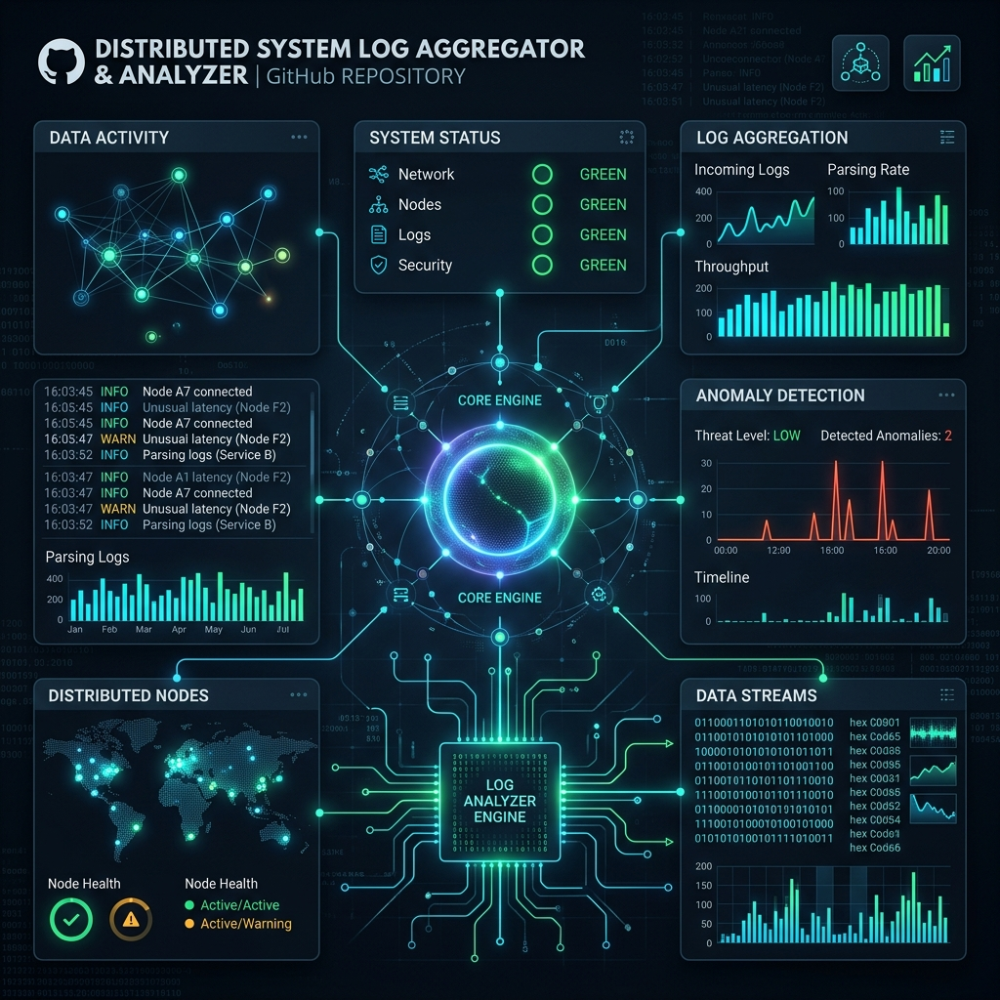
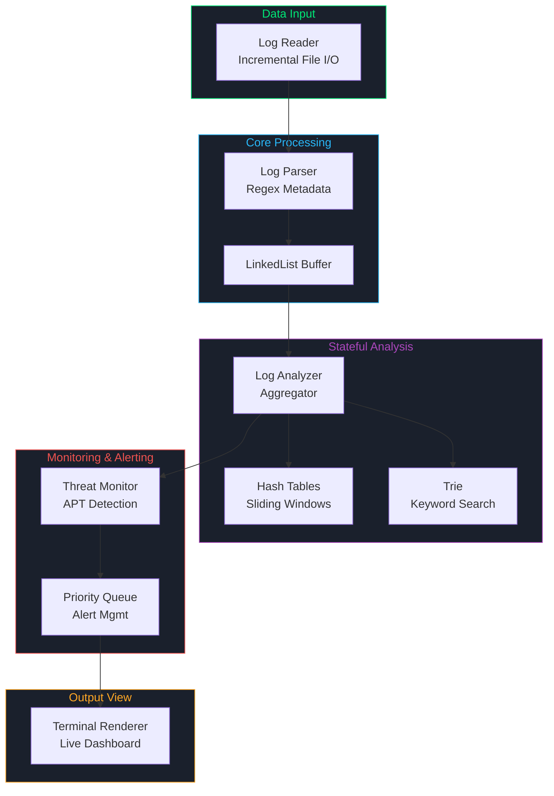

<div align="center">
  
  
  <h1>Distributed System Log Aggregator & Analyzer (v2.0)</h1>

  <p>
    
    
    
    
    
  </p>

  <p>
    <strong>Hệ thống phân tích log thời gian thực và phát hiện mối đe dọa (Threat Detection) hiệu năng cao, ứng dụng chuyên sâu Cấu trúc dữ liệu & Thuật toán.</strong>
  </p>
</div>

---

## 📖 Giới thiệu tổng quan (Overview)

Trong các hệ thống phân tán (distributed systems) quy mô lớn, các dịch vụ (microservices) liên tục sinh ra một lượng log khổng lồ. Việc các kỹ sư hệ thống (SREs / DevOps) phải truy vết lỗi thủ công trên file text là điều bất khả thi.

**Distributed System Log Aggregator & Analyzer** ra đời để giải quyết bài toán này. Ban đầu là một đồ án cốt lõi cho môn học **Data Structures & Algorithms (CSC10004)**, ở phiên bản **v2.0**, hệ thống đã được nâng cấp mạnh mẽ từ một công cụ theo dõi lỗi đơn thuần thành một **Động cơ phát hiện mối đe dọa không gian mạng (Cyber Threat Detection Engine)**. Hệ thống có khả năng theo dõi tấn công có chủ đích (APT), phân tích trạng thái qua các cửa sổ thời gian (Sliding Time Windows), và trích xuất siêu dữ liệu (metadata) bằng Regex.

### 🎯 Kịch bản ứng dụng (The Use Case)

> _2:00 sáng, hệ thống thanh toán bị gián đoạn và log đổ về dồn dập._
> Thay vì tải hàng Gigabyte file log về máy tính, kỹ sư hệ thống khởi động Analyzer. Nhờ thuật toán tra cứu `Trie` siêu tốc và theo dõi trạng thái qua `Sliding Time Windows`, hệ thống lập tức phát hiện một cuộc tấn công Brute-force có tổ chức đến từ một IP cụ thể. Một cảnh báo **CRITICAL** ngay lập tức được đẩy lên đầu qua `Priority Queue`. Kỹ sư khoanh vùng IP, block truy cập và bảo vệ được toàn bộ hệ thống.

---

## ✨ Tính năng nổi bật (Key Features)

- **🛡️ Phát hiện tấn công APT (Threat Detection):** Sử dụng cơ chế cửa sổ thời gian trượt (Sliding Window 60s) để theo dõi các chuỗi hành vi có tổ chức (như Quét mạng, Brute-force, Exfiltration) dựa trên IP nguồn và pattern lỗi.
- **⚡ Truy vấn siêu tốc (Superfast Filtering):** Sử dụng `Trie` cho khả năng tìm kiếm từ khóa (keyword) và tiền tố (prefix) tức thì trên hàng triệu dòng log.
- **📊 Thống kê Real-time (Stateful Analysis):** Cập nhật tần suất lỗi theo `Service_ID` và `Source IP` với độ phức tạp $O(1)$ thông qua `Hash Table`.
- **🚨 Cảnh báo thông minh (Intelligent Alerting):** Định tuyến cảnh báo qua `Priority Queue`, đảm bảo các sự kiện `FATAL` và `CRITICAL` luôn được hiển thị và xử lý trước các thông báo `INFO`.
- **🧠 Tối ưu bộ nhớ (Incremental Reading):** Không bao giờ tải toàn bộ file log vào RAM. Quản lý con trỏ file (file pointers) và đọc log theo từng batch nhỏ (Buffer), giữ mức tiêu thụ RAM luôn thấp (< 50MB) ngay cả với file log nặng hàng GB.
- **🧬 Trích xuất Metadata tự động (Regex Extraction):** Sử dụng C++ `std::regex` để bóc tách thông tin ẩn (như địa chỉ IP, Username) từ các dòng log thô không có cấu trúc.

---

## 🏗️ Kiến trúc & Luồng dữ liệu (Architecture & Pipeline)

Hệ thống hoạt động theo cơ chế **Pipeline**, dữ liệu chảy từ tệp log vào lõi xử lý, qua các thuật toán phân tích, và cuối cùng hiển thị lên Dashboard.



---

## 🧬 Cấu trúc dữ liệu & Thuật toán (DSA Applied)

Toàn bộ các cấu trúc dữ liệu cốt lõi đều được **Tự xây dựng (Custom-built) bằng C++ Templates**. Các template có sẵn của STL như `std::map`, `std::unordered_map` hay `std::priority_queue` bị nghiêm cấm sử dụng để đáp ứng tiêu chuẩn khắt khe của học phần DSA.

| Cấu trúc / Thuật toán     | Vai trò trong dự án                                    | Đánh giá & Độ phức tạp (Complexity)                                                       |
| :------------------------ | :----------------------------------------------------- | :---------------------------------------------------------------------------------------- |
| **LinkedList**            | Buffer lưu trữ tạm thời các object `Log` sau khi parse | $O(1)$ thêm/xóa ở đầu hoặc cuối khi xử lý log theo batch.                                 |
| **Hash Table**            | Đếm lỗi và theo dõi chỉ số `Service_ID` / `Source IP`  | $O(1)$ lookup, tối ưu hóa cho phân tích trạng thái (Stateful metrics).                    |
| **Priority Queue** (Heap) | Quản lý luồng cảnh báo theo mức độ nghiêm trọng        | $O(\log n)$ thao tác push/pop. Đảm bảo lỗi `FATAL` được ưu tiên cực đại.                  |
| **Trie**                  | Tìm kiếm từ khóa và tiền tố lỗi trong Log message      | $O(L)$ ($L$ là độ dài từ khóa). Vượt trội hơn regex trong việc matching string thô.       |
| **BST / AVL Tree**        | Truy vấn log theo thời gian (Time-range queries)       | $O(\log n)$ tự cân bằng. Hỗ trợ trích xuất lịch sử lỗi trong khoảng từ ngày A đến ngày B. |

---

## 🔑 Các kỹ thuật nâng cao (Advanced Techniques)

### 1. Đọc file gia tăng (Incremental Reading)

Thông thường, tải file log 1GB vào code `C++` truyền thống bằng `std::vector` sẽ dẫn đến nguy cơ tràn RAM (Crash) hoặc trễ (Latency) tới hàng chục giây.
Dự án ứng dụng kỹ thuật **Incremental Reading**:
Sử dụng con trỏ file (`seekg`, `tellg`) kết hợp với `sleep_for`, hệ thống chỉ đọc các "batch" mới nhất (ví dụ: 100 dòng mỗi lần) vào Buffer. Khi phân tích xong, log cũ bị đẩy ra khỏi `LinkedList`. Hệ thống có khả năng treo 24/7 như một service ngầm (Daemon) mà không tiêu tốn thêm RAM.

### 2. Phân tích có trạng thái (Stateful Analysis)

Các hệ thống đọc file từng batch thường mắc lỗi: Quên mất dữ liệu ở batch trước.
Nhờ kết hợp `Hash Table` với hàng đợi ghi chú thời gian, hệ thống có khả năng kết nối sự kiện (correlation) qua không gian và thời gian. Một cuộc tấn công Brute-force có thể tản mạn mỗi giây 1 log, nhưng khi cửa sổ `60s Sliding Window` tích lũy đủ số lượng (Threshold), nó vẫn sẽ kích hoạt báo động hệ thống.

### 3. State Machine Giao Diện (Terminal UI)

Người dùng không bị chặn bởi lệnh nhập phím cơ bản như `std::cin`. Các hàm non-blocking (`kbhit`) được mô phỏng trên cả Windows và Linux để nhận biết Hotkey (Phím tắt). Bạn có thể dễ dàng chuyển sang màn hình Dashboard tổng hợp mà hệ thống vẫn duy trì xử lý log chạy ngầm.

---

## 🚀 Hướng dẫn Cài đặt & Biên dịch (Installation & Build)

### ✅ Yêu cầu hệ thống (Prerequisites)

- **OS:** Linux, macOS, hoặc Windows (WSL / MinGW).
- **Compiler:** GCC ≥ 9.0 hoặc Clang ≥ 11.0 (Bắt buộc hỗ trợ **C++17**).
- **Build Tool:** `make` (Linux/macOS) hoặc `mingw32-make` (Windows).

### 🛠️ Các bước thực hiện (Quick Start)

```bash
# 1. Clone repository
git clone https://github.com/yourusername/syslog-analyzer-core.git
cd syslog-analyzer-core

# 2. Biên dịch hệ thống bằng Makefile
make build

# 3. Khởi chạy
make run
```

### 📋 Các lệnh hỗ trợ (Build Commands)

| Lệnh         | Chức năng                                                                     |
| :----------- | :---------------------------------------------------------------------------- |
| `make build` | Build các file mã nguồn thành file thực thi `syslog_analyzer`.                |
| `make run`   | Khởi chạy chương trình ngay lập tức.                                          |
| `make test`  | Chạy toàn bộ các bộ test tự động (DSA Test, Stateful Test, Integration Test). |
| `make clean` | Dọn dẹp không gian làm việc (xóa file object `.o` và binary cũ).              |

---

## 💻 Kịch bản Sử dụng (Interface & Demo)

Hệ thống cho phép hiển thị **Live Dashboard** chạy trực tiếp trên Terminal với màu ANSI sống động.

### 🛡️ Kịch bản: Giả lập tấn công mạng (APT Simulation)

Trong thư mục `data/` có chứa file `raw_logs.txt`. Ở phiên bản v2.0, file này đã được giả lập tiêm (inject) 4 giai đoạn của một cuộc tấn công tinh vi:

1. **Network Scanning** (Quét cổng mạng).
2. **Brute-Force Authentication** (Dò mật khẩu liên tục vào SSH/DB).
3. **Exploitation** (Khai thác lỗi tràn bộ đệm/SQL Injection).
4. **Data Exfiltration** (Hành vi đánh cắp dữ liệu trái phép).

**Cách xem luồng tấn công:**

1. Chạy chương trình với lệnh `make run`.
2. Mở chế độ **Live Monitor**.
3. Cùng với việc trích xuất địa chỉ IP (ví dụ `192.168.1.100`) bằng Regex, hệ thống sẽ phát hiện hành vi Brute-force và chớp đỏ báo động **[IP ALERT] Top Malicious IP**. Ở chế độ Dashboard, IP tấn công này sẽ ngay lập tức bị đưa lên bảng vàng "Vô danh".

---

## 📂 Cấu trúc Repository (Repository Structure)

```bash
syslog-analyzer-core/
├── README.md               # Tài liệu dự án (File này)
├── Makefile                # Kịch bản tự động biên dịch
├── assets/                 # Chứa hình ảnh minh họa (Header Image)
│   └── header.png
├── app/                    # 🎯 APPLICATION LAYER (Lõi xử lý chính)
│   ├── core/               # Cấu trúc Log, Logic Parser (Regex Extract)
│   ├── processing/         # Log Analyzer, Log Monitor (Sliding Window)
│   ├── source/             # Trình I/O file, Mock Generator
│   ├── output/             # Alert Notifier, CLI Renderer (Dashboard UI)
│   └── main.cpp            # Điểm khởi chạy (Orchestrator) kết nối các luồng
├── lib/                    # 📚 CUSTOM DSA LIBRARY (CTDL Tự viết)
│   ├── LinkedList.hpp
│   ├── HashTable.hpp
│   ├── PriorityQueue.hpp
│   ├── Trie.hpp
│   └── AVL.hpp
├── data/                   # Thư mục lưu file log (Mock APT Attacks)
└── tests/                  # Bộ Test C++ tự động (Unit Test / Integration)
```

---

## 📜 Giấy phép (License)

Dự án này được phân phối dưới giấy phép **MIT License**. Xem file `LICENSE` để biết thêm chi tiết.

<div align="center">
  <i>Trạng thái: ⚡ Phát triển tích cực (Phiên bản 2.0)</i>
</div>
