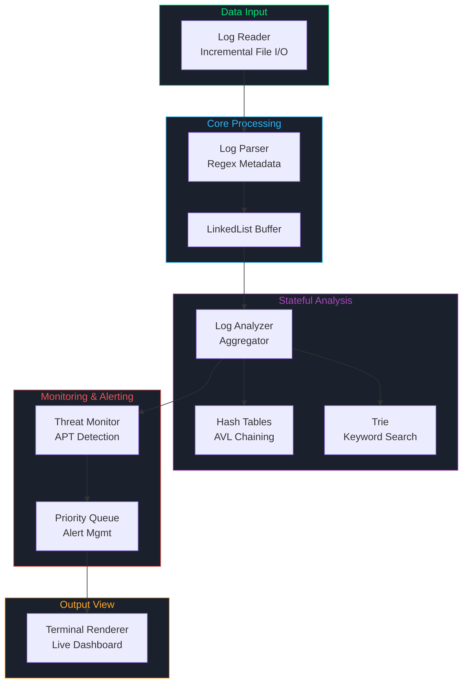

# Distributed System Log Aggregator \& Analyzer

<div align="center">
  
  
  <p>
    
    
    
    
    
  </p>

  <p>
    <strong>Hệ thống phân tích log thời gian thực và phát hiện mối đe dọa an ninh (Cyber Threat Detection Engine) hiệu năng cao, ứng dụng chuyên sâu Cấu trúc dữ liệu & Thuật toán tự viết dạng Templates.</strong>
  </p>
</div>

---

## 📖 Giới thiệu tổng quan (Overview)

Trong các hệ thống phân tán (Distributed Systems) quy mô lớn, các dịch vụ (microservices) liên tục sinh ra một lượng log khổng lồ. Việc các kỹ sư hệ thống (SREs / DevOps) phải truy vết lỗi thủ công trên file text là điều bất khả thi và tốn kém thời gian.

**Distributed System Log Aggregator \& Analyzer** ra đời để giải quyết bài toán này. Hệ thống có khả năng theo dõi tấn công có chủ đích (APT), phân tích trạng thái sự cố qua các cửa sổ thời gian trượt (Sliding Time Windows), định tuyến cảnh báo thông minh theo độ nghiêm trọng, và trích xuất siêu dữ liệu (metadata) bằng Regex.

### 🎯 Kịch bản ứng dụng thực tế (The Use Case)

> _2:00 sáng, hệ thống thanh toán bị gián đoạn và log lỗi đổ về dồn dập._
> Thay vì tải hàng Gigabyte file log về máy tính, kỹ sư hệ thống khởi động Analyzer. Nhờ thuật toán tra cứu `Trie` siêu tốc và theo dõi trạng thái qua `Sliding Time Windows`, hệ thống lập tức phát hiện một cuộc tấn công Brute-force có tổ chức đến từ một IP cụ thể. Một cảnh báo **CRITICAL/FATAL** ngay lập tức được đẩy lên đầu qua `Priority Queue`. Kỹ sư khoanh vùng IP, block truy cập và bảo vệ thành công hệ thống.

---

## ✨ Tính năng nổi bật (Key Features)

- **🛡️ Phát hiện tấn công APT (Threat Detection):** Sử dụng cơ chế cửa sổ thời gian trượt (Sliding Window 60s) để theo dõi các chuỗi hành vi nguy hại (như Quét mạng, Brute-force, Exfiltration) dựa trên IP nguồn và các pattern lỗi.
- **⚡ Truy vấn siêu tốc (Superfast Filtering):** Sử dụng `Trie` cho khả năng tìm kiếm từ khóa (keyword) và tiền tố (prefix) tức thì trên hàng triệu dòng log.
- **📊 Thống kê Real-time (Stateful Analysis):** Cập nhật tần suất lỗi theo `Service_ID` và `Source IP` với độ phức tạp trung bình $O(1)$ thông qua `Hash Table` sử dụng bucket là các cây tự cân bằng `AVL`.
- **🚨 Cảnh báo thông minh (Intelligent Alerting):** Định tuyến cảnh báo qua `Priority Queue` (Binary Max-Heap), đảm bảo các sự kiện `FATAL` và `CRITICAL` luôn được hiển thị và xử lý trước các thông báo thường.
- **🧠 Tối ưu bộ nhớ (Incremental Reading):** Quản lý con trỏ file (`seekg`, `tellg`) và đọc log theo từng batch nhỏ (Buffer), giữ mức tiêu thụ RAM luôn cực kỳ thấp (< 50MB) ngay cả với file log nặng hàng GB.
- **🧬 Trích xuất Metadata tự động (Regex Extraction):** Sử dụng C++ `std::regex` kết hợp các hàm giải mã hex và Base64 để bóc tách thông tin ẩn (như địa chỉ IP, Username) từ các dòng log thô bị làm rối.

---

## 🏗️ Kiến trúc & Luồng dữ liệu (Architecture & Pipeline)

Dữ liệu chảy từ tệp log vào lõi xử lý, qua các thuật toán phân tích, và cuối cùng hiển thị lên Dashboard.



---

## 🧬 Cấu trúc dữ liệu & Thuật toán (DSA Applied)

Để đáp ứng tiêu chuẩn học thuật cao nhất của môn học DSA, toàn bộ các cấu trúc dữ liệu trong thư viện `lib/` đều được tự xây dựng bằng C++ Templates:

| Cấu trúc / Thuật toán  | Vai trò trong dự án                                    | Độ phức tạp thời gian (Time Complexity)                                 |
| :--------------------- | :----------------------------------------------------- | :---------------------------------------------------------------------- |
| **LinkedList**         | Buffer lưu trữ tạm thời các object `Log` sau khi parse | $O(1)$ thêm/xóa ở đầu hoặc cuối.                                        |
| **Vector**             | Mảng động tự co giãn quản lý Heap cho Priority Queue   | $O(1)$ truy cập ngẫu nhiên, $O(1)$ khấu hao cho việc thêm cuối.         |
| **Hash Table**         | Đếm lỗi và theo dõi chỉ số `ServiceID` / `Source IP`   | $O(1)$ trung bình nhờ cơ chế AVL Chaining.                              |
| **Priority Queue**     | Quản lý luồng cảnh báo theo mức độ nghiêm trọng        | $O(\log n)$ thao tác push/pop. FATAL được ưu tiên cực đại.              |
| **Trie**               | Tìm kiếm từ khóa và tiền tố lỗi trong Log message      | $O(L)$ ($L$ là độ dài từ khóa). Không bị ảnh hưởng bởi số từ khóa.      |
| **BST / AVL Tree**     | Giải quyết xung đột trong Bảng băm (AVL Chaining)      | $O(\log n)$ tự cân bằng bằng các phép xoay đơn/kép.                     |
| **Sorting Algorithms** | Sắp xếp dữ liệu đầu vào hoặc bảng thống kê             | Hỗ trợ Quick Sort, Merge Sort, Heap Sort với độ phức tạp $O(n \log n)$. |

---

## 🔑 Các kỹ thuật nâng cao & Đảm bảo an toàn bộ nhớ

### 1. Áp dụng quy tắc năm thuộc tính (Rule of Five)

Khi Vector mở rộng dung lượng, nó cần di chuyển các đối tượng phức tạp như `LinkedList` sang vùng nhớ mới. Việc cài đặt tường minh **Move Constructor** và **Move Assignment Operator** với từ khóa `noexcept` giúp chương trình chuyển quyền sở hữu con trỏ vùng nhớ cũ sang vùng nhớ mới một cách cực nhanh và triệt tiêu nguy cơ lỗi giải phóng bộ nhớ kép (Double Free / `0xC0000005` Access Violation).

### 2. An toàn ngoại lệ mạnh (Copy-and-Swap Idiom)

Toán tử gán `operator=` của `Vector` được cài đặt theo kỹ thuật Copy-and-Swap. Bản sao tạm thời được tạo trước, nếu xảy ra lỗi thiếu bộ nhớ (`std::bad_alloc`), đối tượng Vector hiện tại vẫn nguyên vẹn dữ liệu.

### 3. Tối ưu hiệu năng bóc tách Hex (Exception Avoidance)

Thay thế việc gọi `std::stoi` trong khối `try-catch` bằng cách tiền kiểm tra chuỗi hex qua `std::isxdigit`. Điều này giúp giảm thiểu chi phí giải phóng ngăn xếp (Stack Unwinding) khi gặp các log nhiễu phi-hex, tăng tốc độ đọc của parser lên hàng chục lần.

---

## 🚀 Hướng dẫn Cài đặt & Biên dịch (Installation & Build)

### ✅ Yêu cầu hệ thống (Prerequisites)

- **OS:** Windows (MSYS2/MinGW), Linux, hoặc macOS.
- **Compiler:** GCC $\ge$ 9.0 hoặc Clang $\ge$ 11.0 (hỗ trợ **C++17**).
- **Build Tool:** `make` (Linux/macOS) hoặc `mingw32-make` (Windows).

### 🛠️ Các lệnh biên dịch & Khởi chạy (Commands)

| Lệnh         | Chức năng                                                                                    |
| :----------- | :------------------------------------------------------------------------------------------- |
| `make`       | Biên dịch toàn bộ dự án thành file thực thi `build/syslog_analyzer` (target mặc định `all`). |
| `make run`   | Tự động build và khởi chạy chương trình cùng file log `data/raw_logs.txt`.                   |
| `make test`  | Tự động biên dịch và chạy 55 bài kiểm thử tự động (`tests/lib` và `tests/app`).              |
| `make clean` | Dọn dẹp sạch sẽ thư mục `build/` (các file `.o` và binary cũ).                               |

---

## 💻 Kịch bản Sử dụng (Interface & Demo)

Hệ thống cung cấp giao diện **Live Dashboard** hiển thị trực tiếp trên Terminal với màu sắc sống động:

- **Phím 1:** Chuyển sang màn hình Dashboard thống kê chi tiết (Số lỗi mỗi Service, Top Malicious IP, Cảnh báo hệ thống).
- **Phím 2:** Chuyển sang màn hình Live Monitor hiển thị luồng log thô đang chảy và cảnh báo bảo mật thời gian thực.
- **Phím Q / q:** Thoát chương trình một cách an toàn và giải phóng toàn bộ bộ nhớ.

---

## 📂 Cấu trúc dự án (Repository Structure)

```bash
syslog-analyzer-core/
├── Makefile                # Kịch bản biên dịch tối ưu tự động
├── README.md               # Tài liệu hướng dẫn dự án (File này)
├── reports.tex             # Báo cáo đồ án môn học bằng LaTeX
├── assets/                 # Chứa logo trường và hình ảnh minh họa
├── lib/                    # 📚 THƯ VIỆN CẤU TRÚC DỮ LIỆU ĐỘC LẬP (TEMPLATES)
│   ├── Vector.hpp          # Mảng động
│   ├── LinkedList.hpp      # Danh sách liên kết đôi
│   ├── Stack.hpp / Queue.hpp # Ngăn xếp & Hàng đợi
│   ├── PriorityQueue.hpp   # Hàng đợi ưu tiên (Binary Max-Heap)
│   ├── BST.hpp / AVL.hpp   # Cây BST và Cây tự cân bằng AVL
│   ├── HashTable.hpp       # Bảng băm lai cấu trúc cây AVL
│   ├── Trie.hpp            # Cây tiền tố tra cứu từ khóa nhanh
│   └── Algorithms.hpp      # Các thuật toán sắp xếp & tìm kiếm tổng quát
├── app/                    # 🎯 TẦNG ỨNG DỤNG XỬ LÝ (APPLICATION LAYER)
│   ├── core/               # Trình Log, LogParser (Giải mã Hex/Base64)
│   ├── processing/         # LogAnalyzer, LogMonitor (Sliding Window)
│   ├── source/             # LogReader (Incremental I/O)
│   ├── output/             # AlertNotifier, Renderer (Console GUI)
│   └── main.cpp            # Điều phối viên luồng dữ liệu (Orchestrator)
└── tests/                  # 🧪 HỆ THỐNG UNIT TEST TỰ ĐỘNG (DOCTEST)
    ├── lib/                # Test độ chính xác của Thư viện DSA (34 cases)
    └── app/                # Test luồng xử lý của Ứng dụng (21 cases)
```

---

## 📜 Giấy phép (License)

Dự án này được phân phối dưới giấy phép **MIT License**.
