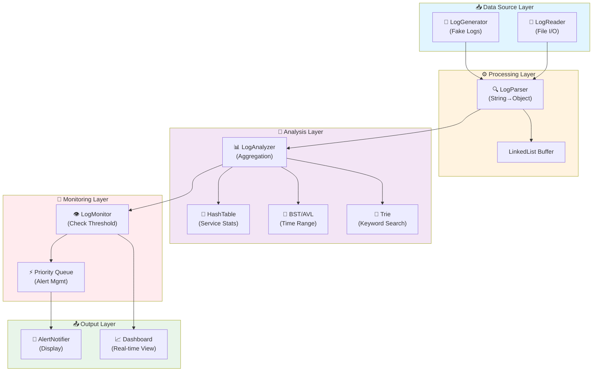

<h1 align="center">Distributed System Log Aggregator & Analyzer</h1>

<p align="center">
  
  
  
  
</p>

<p align="center">
  <strong>Hệ thống giả lập thu thập, phân tích và cảnh báo lỗi từ hàng nghìn dòng log của các dịch vụ phân tán.</strong>
</p>

---

## 📖 Giới thiệu tổng quan

Trong các hệ thống phân tán quy mô lớn, log được sinh ra liên tục với khối lượng khổng lồ. Việc các kỹ sư hệ thống (SRE/DevOps) phải đọc và tìm kiếm lỗi thủ công là bất khả thi. Các hệ thống hiện tại thường là "hộp đen", khiến việc dò tìm nguyên nhân sự cố (troubleshooting) mất hàng giờ đồng hồ.

**Distributed System Log Aggregator & Analyzer** ra đời nhằm giải quyết bài toán trên. Đây là đồ án môn **Data Structures & Algorithms (CSC10004)**, tập trung ứng dụng các cấu trúc dữ liệu nâng cao như **Trie, Hash Table, và Priority Queue** để:

- Tìm kiếm các pattern lỗi cực nhanh.
- Phân tích và thống kê tần suất lỗi theo thời gian thực.
- Xếp hạng mức độ nghiêm trọng và đưa ra cảnh báo kịp thời.

### 🎯 Kịch bản ứng dụng (Use Case)

> _2:00 sáng, hệ thống thanh toán bị gián đoạn._
> Thay vì tải toàn bộ log về máy để "mò kim đáy biển", kỹ sư SRE mở Terminal, hệ thống tự động lọc các dòng log có chứa từ khóa `ERROR` hoặc `TIMEOUT` từ hàng loạt microservices. Dữ liệu được sắp xếp theo thời gian và mức độ nghiêm trọng, giúp kỹ sư phát hiện ngay nguyên nhân là do "Kết nối Database bị nghẽn" (được đánh dấu **CRITICAL**).

## 🎯 Các tính năng chính

- **Lọc và tìm kiếm siêu tốc:** Sử dụng `Trie` để tra cứu các tiền tố (prefix) và từ khóa lỗi trong tích tắc.
- **Thống kê Real-time:** Ứng dụng `Hash Table` để đếm tần suất lỗi theo `Service_ID` với độ phức tạp $O(1)$.
- **Cảnh báo thông minh:** Quản lý luồng log sự cố bằng `Priority Queue`, đảm bảo các lỗi `FATAL` / `CRITICAL` luôn được đẩy lên ưu tiên xử lý trước các thông báo `INFO`.
- **Sắp xếp theo thời gian:** Tối ưu hóa việc hiển thị dòng thời gian sự kiện bằng `BST/AVL` để truy vấn nhanh theo khoảng thời gian.
- **Simulate Real-time Logging:** Tích hợp tính năng giả lập (inject) log lỗi trực tiếp để kiểm thử luồng cảnh báo.
- **⚡ Incremental Reading (Đọc Gia Tăng):** Xử lý file log khổng lồ mà không cần tải toàn bộ vào RAM (sử dụng con trỏ file và buffer).

## 🔑 Kỹ thuật Incremental Reading (Đọc Gia Tăng)

### 🤔 Vấn đề

Giả sử file log lớn 1GB, có **20 triệu dòng**. Nếu tải toàn bộ vào RAM:

```
RAM Usage: ~1GB → Hệ thống có thể crash!
Thời gian load: Mất hàng chục giây trước khi có thể xử lý.
```

### 💡 Giải pháp: Incremental Reading

**Thay vì tải toàn bộ, chúng ta đọc từng dòng (hoặc batch nhỏ) theo từng lần:**

```cpp
// Cách truyền thống (BAD - không khả thi)
std::vector<Log> allLogs = reader.readAll();  // ❌ Tải 1GB vào RAM

// Cách Incremental (GOOD - tối ưu)
while (reader.hasNext()) {                    // ✅ Đọc từng dòng
    Log log = reader.readNextLine();
    analyzer.process(log);                    // Xử lý ngay, không chờ
}
```

### 📊 Lợi ích

| Tiêu chí              | Tải toàn bộ | Incremental   |
| :-------------------- | :---------- | :------------ |
| **RAM Usage**          | 1GB         | ~10-50MB      |
| **Latency (Delay)**    | 30s         | < 1s          |
| **Throughput**         | Sau 30s     | Liên tục      |
| **Khả năng Real-time** | ❌ Không    | ✅ Có         |

### 🏗️ Cách triển khai trong dự án

```cpp
// LogReader.hpp - Quản lý file pointer
class LogReader {
private:
    std::ifstream file;
    std::string buffer;           // Chunk nhỏ (~4KB)
    size_t bufferPos = 0;
    
public:
    bool hasNext();
    Log readNextLine();           // Đọc 1 dòng
    std::vector<Log> readBatch(size_t n);  // Đọc batch n dòng
};

// Sử dụng trong main.cpp
LogReader reader("data/raw_logs.txt");
LinkedList<Log> buffer;           // Buffer nhỏ (~100 logs)

while (reader.hasNext()) {
    Log log = reader.readNextLine();
    
    // Xử lý ngay (không chờ)
    analyzer.add(log);
    monitor.check(log);
    
    // Nếu buffer đầy, xóa đi 10%
    if (buffer.size() > MAX_SIZE) {
        buffer.removeOldest(10);
    }
}
```

## 🧠 Kiến thức DSA Áp Dụng

| Cấu trúc / Thuật toán        | Mục đích áp dụng trong dự án                                    | Lý do lựa chọn                                                                          | Độ phức tạp |
| :--------------------------- | :-------------------------------------------------------------- | :-------------------------------------------------------------------------------------- | :---------- |
| **LinkedList**               | Quản lý Buffer log (chuỗi dữ liệu trong bộ nhớ)                 | Hỗ trợ thêm/xóa phần tử linh hoạt, quản lý vòng đời dữ liệu trong pipeline.             | O(n)        |
| **Hash Table**               | Đếm tần suất lỗi theo từng dịch vụ (`Service_ID`)               | Cung cấp khả năng truy xuất và mapping với độ phức tạp $O(1)$, tối ưu RAM.              | O(1)        |
| **Binary Search Tree (BST)** | Lưu trữ log theo thời gian (Range Query: tìm log trong khoảng) | Hỗ trợ tìm kiếm theo phạm vi thời gian hiệu quả, giúp phân tích xu hướng lỗi theo ngày. | O(log n)    |
| **AVL Tree**                 | Giữ cây nhị phân tự cân bằng (phiên bản tối ưu)                 | Đảm bảo tốc độ tìm kiếm luôn $O(\log n)$ ngay cả trong trường hợp xấu nhất.              | O(log n)    |
| **Priority Queue** (Heap)    | Quản lý hàng đợi cảnh báo theo mức độ nghiêm trọng              | Tự động ưu tiên lỗi `FATAL` > `CRITICAL` > `ERROR` > `WARN`, xử lý đúng thứ tự.         | O(log n)    |
| **Trie**                     | Tìm kiếm từ khóa lỗi (`ERROR`, `FATAL`, `TIMEOUT`,...)          | Tối ưu hóa tốc độ tìm kiếm tiền tố (prefix search) trên tập từ khóa lớn.                | O(m)        |

**Ghi chú:** $m$ = độ dài string tìm kiếm, $n$ = số phần tử trong tập dữ liệu.

## ⚙️ Kiến trúc hệ thống

### 🔄 Luồng xử lý dữ liệu (Data Pipeline)

```
┌─────────────────────────────────────────────────────────────────┐
│                    DISTRIBUTED LOG ANALYZER                      │
└─────────────────────────────────────────────────────────────────┘

   ┌──────────────────┐
   │  DATA SOURCE     │
   └────────┬─────────┘
            │
    ┌───────┴────────┬─────────────────┐
    │                │                 │
┌───▼──────┐  ┌─────▼──────┐  ┌──────▼──────┐
│LogReader │  │LogGenerator│  │  Custom     │
│  (File)  │  │  (Inject)  │  │  Sources    │
└───┬──────┘  └─────┬──────┘  └──────┬──────┘
    │                │                 │
    └────────────┬───┴─────────────────┘
                 │
         ┌───────▼──────────┐
         │   LogParser      │    [Incremental Reading]
         │  (String -> Obj) │    🔑 Con trỏ file, đọc từng dòng
         └────────┬─────────┘       để tiết kiệm RAM
                  │
         ┌────────▼───────────┐
         │   LogAnalyzer      │    [Cấu trúc dữ liệu chính]
         │ ┌────────────────┐ │    • HashTable: đếm lỗi/Service
         │ │ • LinkedList   │ │    • BST/AVL: sắp xếp theo thời gian
         │ │ • Trie         │ │    • Trie: tìm kiếm nhanh keyword
         │ │ • HashTable    │ │
         │ └────────────────┘ │
         └────────┬───────────┘
                  │
         ┌────────▼──────────┐
         │   LogMonitor      │    [State Machine]
         │  ┌──────────────┐ │    STATES: LIVE ⟷ STATISTICS
         │  │ Check Status │ │    (Chế độ giám sát hay báo cáo)
         │  │ & Threshold  │ │
         │  └──────────────┘ │
         └────────┬──────────┘
                  │
    ┌─────────────┴──────────────┐
    │                            │
┌───▼────────────────┐    ┌─────▼──────────────┐
│  AlertNotifier     │    │  Dashboard/Report  │
│  (Priority Queue)  │    │  (User Interface)  │
│ Push CRITICAL      │    │  [Chế độ Live]     │
│ và FATAL trước     │    │  Cập nhật real-time│
└────────────────────┘    └────────────────────┘
```

### 📊 Sơ đồ Mermaid (Tương tác Module)



### 🎯 Tính năng State Machine (UI)

Hệ thống hỗ trợ 2 chế độ hoạt động quay lại quay lui:

```
    ┌──────────────────────────────────────────┐
    │     USER INTERACTION STATE MACHINE       │
    └──────────────────────────────────────────┘

    ┌─────────────────┐
    │   LIVE MODE     │  🟢 Hiển thị log real-time
    │ (Monitoring)    │     - Thêm dòng log mới
    │                 │     - Cảnh báo tức thì
    │ [Ctrl+L]        │
    └────────┬────────┘
             │
             │ [Ctrl+S]
             ▼
    ┌─────────────────┐
    │STATISTICS MODE  │  📊 Hiển thị báo cáo thống kê
    │  (Dashboard)    │     - Top lỗi theo Service
    │                 │     - Xu hướng theo ngày/giờ
    │ [Ctrl+L]        │     - Tần suất lỗi
    └────────┬────────┘
             │
             │ [Ctrl+S]
             ▼
    ┌─────────────────┐
      (Return to LIVE)

```

## � Kỹ thuật Xử lý và Triển khai Chi tiết

### 1️⃣ Kỹ thuật xử lý Luồng dữ liệu (Data Pipeline)

#### **Incremental Reading (Đọc tiếp nối)**

Thay vì tải toàn bộ file log vào RAM (tốn bộ nhớ, chậm), chúng ta đọc dần từng phần:

```cpp
// Sử dụng con trỏ file (seekg/tellg) để nhớ vị trí cuối cùng
class LogReader {
private:
    std::ifstream file;
    std::streampos lastPos = 0;  // Lưu vị trí đọc
    
public:
    std::vector<Log> readNewLogs() {
        file.seekg(lastPos);     // Quay về vị trí cuối
        // Đọc từ lastPos đến cuối file
        // ...
        lastPos = file.tellg();  // Cập nhật vị trí mới
        return newLogs;
    }
};
```

**Lợi ích:**
- ✅ Xử lý file log "vô tận" mà không lo tràn RAM
- ✅ Độ trễ thấp (< 1s) thay vì 30s để tải toàn bộ
- ✅ Khả năng real-time monitoring

#### **Polling (Thăm dò)**

Vòng lặp chính sử dụng `while(true)` kết hợp với `sleep()` để duy trì trạng thái "luôn sẵn sàng":

```cpp
// main.cpp - Main loop
while (true) {
    // Thăm dò dữ liệu mới
    if (reader.hasNewLogs()) {
        std::vector<Log> logs = reader.readNewLogs();
        analyzer.process(logs);
    }
    
    // Tránh "nóng CPU" bằng sleep
    std::this_thread::sleep_for(std::chrono::milliseconds(100));
}
```

**Tính chất:**
- Hệ thống luôn "sẵn sàng" đón nhận dữ liệu mới
- Sleep tránh lãng phí CPU (không polling quá tần số)

#### **Batch Processing (Xử lý theo lô)**

Đọc và xử lý log theo batch (ví dụ 100 dòng/lần) để cân bằng hiệu năng:

```cpp
const size_t BATCH_SIZE = 100;  // Đọc 100 dòng/lần

while (reader.hasNext()) {
    std::vector<Log> batch = reader.readBatch(BATCH_SIZE);
    
    // Xử lý batch ngay (ko chờ)
    for (const auto& log : batch) {
        analyzer.add(log);
        monitor.check(log);
    }
    
    // Cân bằng: không quá tải (100 dòng) nhưng cũng không bị tồn đọng
}
```

**Ưu điểm:**
- ⚖️ Cân bằng giữa hiệu năng (batch processing) và độ trễ (không bị tồn lâu)
- 🎯 Cho phép xử lý song song trên từng batch (future enhancement)

---

### 2️⃣ Kỹ thuật xử lý Cấu trúc dữ liệu (DSA Integration)

#### **Phân tầng dữ liệu (Composite Architecture)**

Kết hợp nhiều cấu trúc dữ liệu để giải quyết từng bài toán cụ thể:

- **Trie**: Quét từ khóa lỗi (Prefix Matching) với độ phức tạp $O(L)$, nhanh hơn bất kỳ thuật toán duyệt chuỗi nào.
  ```cpp
  // Ví dụ: Tìm từ khóa "ERROR" hoặc "TIMEOUT"
  Trie<char> errorKeywords;
  errorKeywords.insert("ERROR");
  errorKeywords.insert("TIMEOUT");
  errorKeywords.insert("FATAL");
  
  // Tìm kiếm O(L) với L = độ dài string
  if (errorKeywords.search("ERROR")) { /* Cảnh báo */ }
  ```

- **HashTable**: Thống kê số lỗi theo `serviceID` với truy xuất $O(1)$.
  ```cpp
  // Đếm lỗi từng service
  HashTable<std::string, int> serviceErrors;
  
  for (const auto& log : logs) {
      if (log.level == "ERROR") {
          serviceErrors[log.serviceID]++;  // O(1)
      }
  }
  
  // Tìm service nào bị lỗi nhiều nhất
  int maxErrors = 0;
  for (const auto& [service, count] : serviceErrors) {
      if (count > maxErrors) maxErrors = count;
  }
  ```

- **PriorityQueue**: Quản lý hàng đợi cảnh báo, đảm bảo lỗi `FATAL` luôn được xử lý sớm nhất.
  ```cpp
  // Priority: FATAL(3) > CRITICAL(2) > ERROR(1)
  PriorityQueue<Log> alertQueue;
  
  for (const auto& log : logs) {
      alertQueue.push(log, getPriority(log.level));
  }
  
  // Pop theo ưu tiên
  while (!alertQueue.empty()) {
      Log alert = alertQueue.pop();  // Lấy cái có priority cao nhất
      notifier.send(alert);
  }
  ```

- **AVL Tree** (kế thừa từ BST): Lưu trữ log theo dải thời gian (`range search`), cho phép tìm lại các lỗi trong khoảng thời gian cụ thể cực nhanh.
  ```cpp
  // Tìm log trong khoảng thời gian [start_time, end_time]
  AVLTree<time_t, Log> timeIndex;
  
  std::vector<Log> recentErrors = timeIndex.rangeQuery(start_time, end_time);
  // Độ phức tạp: O(log n + k) với k = số kết quả
  ```

#### **Stateful Analysis (Phân tích có trạng thái)**

Hệ thống không "quên" dữ liệu cũ. Việc kết hợp dữ liệu giữa các batch khác nhau thông qua `HashTable` giúp phát hiện hành vi tấn công (ví dụ: Brute Force) dù lỗi nằm rải rác ở các lần đọc khác nhau:

```cpp
// Phát hiện Brute Force Attack: 10+ lỗi authentication trong 1 phút
HashTable<std::string, std::vector<time_t>> authFailures;

for (const auto& log : batch) {
    if (log.message.find("Authentication Failed") != std::string::npos) {
        authFailures[log.serviceID].push_back(log.timestamp);
    }
}

// Kiểm tra: có bao nhiêu lần thất bại trong 60 giây gần nhất?
for (const auto& [service, times] : authFailures) {
    int recentCount = 0;
    time_t now = std::time(nullptr);
    for (time_t t : times) {
        if (now - t < 60) recentCount++;
    }
    
    if (recentCount >= 10) {
        notifier.alert("Possible Brute Force Attack on " + service);
    }
}
```

---

### 3️⃣ Kỹ thuật UI/UX và Giao diện (Terminal Dashboard)

#### **State Machine (Máy trạng thái)**

Chuyển đổi giữa chế độ `Live Monitor` và `Statistics View` mà không cần tắt/mở lại chương trình:

```cpp
// app/processing/LogMonitor.h
enum class UIMode {
    LIVE = 0,           // 🟢 Hiển thị real-time
    STATISTICS = 1      // 📊 Hiển thị báo cáo thống kê
};

class LogMonitor {
private:
    UIMode currentMode = UIMode::LIVE;
    
public:
    void switchMode() {
        if (currentMode == UIMode::LIVE) {
            currentMode = UIMode::STATISTICS;
        } else {
            currentMode = UIMode::LIVE;
        }
        refreshDisplay();
    }
    
    void display() {
        if (currentMode == UIMode::LIVE) {
            displayLiveMode();
        } else {
            displayStatisticsMode();
        }
    }
};
```

#### **Non-blocking Input (Nhập liệu không chặn)**

Sử dụng kỹ thuật kiểm tra phím bấm (như `kbhit` hoặc `signal`) để người dùng có thể thoát hoặc chuyển chế độ bằng phím tắt ngay trong vòng lặp chính:

```cpp
// main.cpp - Main loop
while (true) {
    // Xử lý dữ liệu (không bị chặn)
    if (reader.hasNewLogs()) {
        std::vector<Log> logs = reader.readNewLogs();
        analyzer.process(logs);
    }
    
    // Kiểm tra phím bấm (non-blocking)
    if (_kbhit()) {
        int key = _getch();
        if (key == 'S' || key == 's') {
            monitor.switchMode();  // [S] = Switch mode
        } else if (key == 'Q' || key == 'q') {
            break;  // [Q] = Quit
        }
    }
    
    std::this_thread::sleep_for(std::chrono::milliseconds(100));
}
```

#### **Visual Alerting (Cảnh báo thị giác)**

Sử dụng ANSI Escape Codes để tô màu cho log, giúp người quản trị "liếc mắt" là thấy sự cố:

```cpp
// app/output/AlertNotifier.h
const char* COLOR_RED = "\033[1;31m";      // Đỏ (FATAL)
const char* COLOR_YELLOW = "\033[1;33m";   // Vàng (WARNING)
const char* COLOR_GREEN = "\033[1;32m";    // Xanh (OK)
const char* COLOR_RESET = "\033[0m";       // Reset

void AlertNotifier::display(const Log& log) {
    std::string color;
    
    if (log.level == "FATAL") {
        color = COLOR_RED;
    } else if (log.level == "WARNING") {
        color = COLOR_YELLOW;
    } else {
        color = COLOR_GREEN;
    }
    
    std::cout << color << "[" << log.timestamp << "] " 
              << log.level << ": " << log.message 
              << COLOR_RESET << std::endl;
}
```

#### **Clean-screen Dashboard (Bảng điều khiển tĩnh)**

Sử dụng `system("clear/cls")` kết hợp in lại toàn bộ khung bảng điều khiển để tạo hiệu ứng Dashboard tĩnh:

```cpp
void LogMonitor::displayLiveMode() {
    system("clear");  // Linux/macOS
    // system("cls");  // Windows
    
    std::cout << "╔════════════════════════════════════════════════╗\n";
    std::cout << "║       SYSLOG ANALYZER - LIVE MONITOR          ║\n";
    std::cout << "╚════════════════════════════════════════════════╝\n";
    std::cout << "Total Errors: " << analyzer.getErrorCount() << "\n";
    std::cout << "Last Update: " << getCurrentTime() << "\n";
    std::cout << "\nRecent Alerts:\n";
    
    // In các alert gần đây
    for (const auto& log : analyzer.getRecentAlerts(10)) {
        display(log);
    }
    
    std::cout << "\n[S]witch | [Q]uit\n";
}
```

---

### 4️⃣ Kỹ thuật Xử lý sự cố (Error Handling)

#### **Graceful Exit (Thoát an toàn)**

Bắt tín hiệu `SIGINT` (Ctrl+C) để đóng file và dọn dẹp tài nguyên trước khi tắt, tránh việc hỏng file log hoặc leak bộ nhớ:

```cpp
// Global variable để signal handler
volatile bool shouldExit = false;

// Signal handler
void handleSignal(int signal) {
    if (signal == SIGINT) {
        shouldExit = true;
        std::cout << "\n[INFO] Gracefully shutting down...\n";
    }
}

// main.cpp
int main() {
    // Đăng ký signal handler
    std::signal(SIGINT, handleSignal);
    
    LogReader reader("data/raw_logs.txt");
    LogAnalyzer analyzer;
    
    while (!shouldExit) {
        if (reader.hasNewLogs()) {
            auto logs = reader.readNewLogs();
            analyzer.process(logs);
        }
        std::this_thread::sleep_for(std::chrono::milliseconds(100));
    }
    
    // Dọn dẹp tài nguyên
    reader.close();
    analyzer.cleanup();
    
    std::cout << "[INFO] Cleanup completed. Goodbye!\n";
    return 0;
}
```

#### **Config-driven Development (Phát triển dựa trên cấu hình)**

Tách các thông số như `threshold`, `path`, `timeout` ra file `config.h` để dễ dàng điều chỉnh cấu hình mà không cần biên dịch lại code:

```cpp
// app/config/config.h
#pragma once

// ========== FILE PATHS ==========
const char* LOG_FILE_PATH = "data/raw_logs.txt";
const char* OUTPUT_FILE_PATH = "output/alerts.log";

// ========== BUFFER & BATCH SETTINGS ==========
const size_t MAX_BUFFER_SIZE = 10000;        // Kích thước buffer tối đa
const size_t BATCH_SIZE = 100;               // Số log/lần đọc
const size_t BATCH_TIMEOUT_MS = 500;         // Thời gian chờ batch (ms)

// ========== THRESHOLDS & ALERT LEVELS ==========
const int ERROR_THRESHOLD = 50;              // Cảnh báo khi lỗi > 50/phút
const int WARNING_THRESHOLD = 20;
const int CRITICAL_THRESHOLD = 100;

// ========== POLLING SETTINGS ==========
const int POLLING_INTERVAL_MS = 100;         // Thăm dò mỗi 100ms
const int SLEEP_ON_IDLE_MS = 1000;          // Sleep 1s khi ko có dữ liệu

// ========== UI/DISPLAY ==========
const bool ENABLE_COLOR_OUTPUT = true;       // Bật tô màu ANSI
const int REFRESH_RATE_MS = 500;            // Cập nhật dashboard mỗi 500ms

// ========== DEBUG ==========
const bool DEBUG_MODE = false;               // In debug info
const bool LOG_TO_FILE = true;               // Lưu log ra file
```

**Sử dụng:**

```cpp
// app/processing/LogAnalyzer.cpp
#include "../config/config.h"

void LogAnalyzer::checkThreshold(const Log& log) {
    if (log.level == "ERROR" && errorCount > ERROR_THRESHOLD) {
        AlertNotifier::alert("Error rate exceeded: " + std::to_string(errorCount));
    }
}

// main.cpp
#include "config/config.h"

int main() {
    LogReader reader(LOG_FILE_PATH);
    LogAnalyzer analyzer;
    
    // Đảo ngược cấu hình dễ dàng mà không cần recompile
    while (true) {
        if (reader.hasNewLogs()) {
            auto logs = reader.readBatch(BATCH_SIZE);
            analyzer.process(logs);
        }
        std::this_thread::sleep_for(std::chrono::milliseconds(POLLING_INTERVAL_MS));
    }
    
    return 0;
}
```

**Lợi ích:**
- ✅ Điều chỉnh thông số mà không cần recompile (thay đổi `config.h` → `make rebuild`)
- ✅ Dễ dàng thử nghiệm các tham số khác nhau
- ✅ Tách biệt cấu hình từ logic code

---

## �📂 Cấu trúc thư mục chi tiết

```
syslog-analyzer-core/
│
├── 📋 README.md                           # Tài liệu dự án (file này)
├── 📜 LICENSE                             # MIT License
├── 🔨 Makefile                            # Script tự động hóa build
├── ⚙️ .clangd & .clang-format             # Cấu hình linter & formatter
│
├── 📂 app/                                # 🎯 APPLICATION LAYER
│   ├── 📂 config/
│   │   └── config.h                       # Các hằng số (MAX_BUFFER_SIZE, ...)
│   │
│   ├── 📂 core/                           # 🧩 CORE DATA STRUCTURES
│   │   ├── Log.h                          # struct Log { timestamp, service_id, level, message }
│   │   ├── Log.cpp                        # Implement Log
│   │   ├── LogParser.h                    # Parse string → Log object
│   │   └── LogParser.cpp                  # Xử lý split(), trim(), format conversion
│   │
│   ├── 📂 source/                         # 📥 INPUT SOURCES
│   │   ├── LogReader.h                    # Đọc file log (Incremental Read)
│   │   ├── LogReader.cpp                  # Quản lý file pointer, buffer
│   │   ├── LogGenerator.h                 # Generate fake logs (testing)
│   │   └── LogGenerator.cpp               # Random timestamp, service_id, level
│   │
│   ├── 📂 processing/                     # ⚙️ BUSINESS LOGIC
│   │   ├── LogAnalyzer.h                  # Xử lý cấu trúc dữ liệu chính
│   │   ├── LogAnalyzer.cpp                # - Sử dụng HashTable, BST, Trie, LinkedList
│   │   │                                   # - Đếm tần suất lỗi
│   │   │                                   # - Tìm kiếm keyword
│   │   ├── LogMonitor.h                   # Kiểm tra ngưỡng (Threshold)
│   │   └── LogMonitor.cpp                 # State Machine logic (LIVE/STATISTICS)
│   │
│   ├── 📂 output/                         # 📤 OUTPUT & NOTIFICATIONS
│   │   ├── AlertNotifier.h                # In cảnh báo (console/file)
│   │   └── AlertNotifier.cpp              # Format & display alerts
│   │
│   ├── main.cpp                           # 🎼 ORCHESTRATOR (nhạc trưởng)
│   │                                       # - Điều phối toàn bộ flow
│   │                                       # - Vòng lặp chính (main loop)
│   │                                       # - Xử lý user input
│   │
│
├── 📂 lib/                                # 📚 DATA STRUCTURES LIBRARY (Template)
│   ├── LinkedList.hpp                     # Danh sách liên kết (quản lý Buffer)
│   ├── Stack.hpp                          # Stack: Last-In-First-Out
│   ├── Queue.hpp                          # Queue: First-In-First-Out
│   ├── HashTable.hpp                      # Hash Table (đếm tần suất)
│   ├── BST.hpp                            # Binary Search Tree (range query)
│   ├── AVL.hpp                            # AVL Tree (auto-balanced)
│   ├── PriorityQueue.hpp                  # Priority Queue / Heap
│   ├── Trie.hpp                           # Trie (prefix search)
│   └── Algorithms.hpp                     # Utility: QuickSort, BinarySearch, ...
│
├── 📂 data/                               # 📊 DATA FILES
│   └── raw_logs.txt                       # Sample log data để test
│
└── 📂 .git/                               # Git repository
```

### 📝 Ghi chú cấu trúc

- **`app/core/`**: Lớp dữ liệu nền tảng. Định nghĩa struct `Log` là "ngôn ngữ chung" của toàn bộ hệ thống.
- **`app/source/`**: Lớp nhập liệu. LogReader hỗ trợ **Incremental Reading** (con trỏ file) để xử lý file khổng lồ mà không tải toàn bộ vào RAM.
- **`app/processing/`**: Lớp xử lý lõi. LogAnalyzer là "não bộ" của dự án, sử dụng tất cả CTDL từ `lib/`.
- **`app/output/`**: Lớp kết xuất. Cảnh báo được quản lý qua **Priority Queue** để đảm bảo FATAL được xử lý trước.
- **`lib/`**: Tất cả cấu trúc dữ liệu được viết bằng **Template C++**, tái sử dụng được cho nhiều kiểu dữ liệu.

## 🛠 Hướng dẫn cài đặt, biên dịch và sử dụng

### ✅ Yêu cầu hệ thống

- **OS:** Linux, macOS, hoặc Windows (WSL/MinGW)
- **Compiler:** GCC ≥ 9.0 hoặc Clang ≥ 11.0 (hỗ trợ C++17)
- **Build Tool:** `make` (Linux/macOS) hoặc `mingw32-make` (Windows)
- **RAM:** Tối thiểu 256MB (nhờ Incremental Reading, không cần nhiều)

### 1️⃣ Clone & Chuẩn bị

```bash
# Clone repository
git clone https://github.com/yourusername/syslog-analyzer-core.git
cd syslog-analyzer-core

# Kiểm tra trình biên dịch
g++ --version       # GCC
clang++ --version   # Clang (tùy chọn)
make --version      # Make
```

### 2️⃣ Biên dịch (Build)

#### **Cách 1: Sử dụng Makefile (Khuyến cáo)**

```bash
# Build toàn bộ dự án
make build

# Build và chạy ngay
make run

# Xóa file object (clean up)
make clean

# Build lại hoàn toàn
make rebuild
```
### 📍 Tuần 1: Nền tảng & Cấu trúc dữ liệu

- **Tuần 1.1 - Ngày 1-3 (Thành viên A & B)**
  - [ ] Thiết kế kiến trúc, setup project structure
  - [ ] Cài đặt các CTDL cơ bản: **LinkedList**, **Stack**, **Queue** (Template C++)
  - [ ] Viết unit test cho từng CTDL
  - **Milestone:** Có thể compile & test LinkedList, Stack, Queue

- **Tuần 1.2 - Ngày 4-7 (Thành viên A)**
  - [ ] Hoàn thiện module `LogParser` để chuyển string → Log object
  - [ ] Cài đặt `HashTable` (template) với collision handling (chaining/open addressing)
  - [ ] Tích hợp HashTable vào `LogAnalyzer` để đếm lỗi
  - **Milestone:** `make build` và `make run` chạy không lỗi

### 📍 Tuần 2: Tối ưu hóa & Hoàn thiện

## ⚠️ Lưu ý quan trọng

### 1️⃣ Cài đặt tự thủ CTDL

**Nguyên tắc đơn giản:** Chúng tôi tự cài đặt các cấu trúc dữ liệu trong `lib/`, **KHÔNG** sử dụng STL có sẵn cho các phần bắt buộc:

```cpp
// ❌ KHÔNG được phép (nếu bài tập bắt buộc cài đặt)
#include <map>           // ❌ std::map
#include <unordered_map> // ❌ std::unordered_map
#include <queue>         // ❌ std::priority_queue
#include <set>           // ❌ std::set
#include <deque>         // ❌ std::deque

// ✅ ĐƯỢC phép (STL phục vụ - không liên quan đến CTDL cốt lõi)
#include <iostream>      // ✅ I/O
#include <vector>        // ✅ Tạm thời chứa dữ liệu (vì đơn giản hơn)
#include <string>        // ✅ String manipulation
#include <fstream>       // ✅ File I/O
#include <ctime>         // ✅ Timestamp
#include <algorithm>     // ✅ Utility functions
```

### 2️⃣ Memory Management

Dự án tuân theo **RAII Pattern** để tránh memory leak:

```cpp
// ✅ ĐÚNG (Auto cleanup)
class LinkedList {
private:
    Node* head;
public:
    LinkedList() : head(nullptr) {}
    ~LinkedList() { deleteAll(); }  // Destructor tự động xóa
    
    void deleteAll() {
        while (head) {
            Node* temp = head;
            head = head->next;
            delete temp;
        }
    }
};

// ❌ SAI (Manual cleanup, dễ quên)
void memory_leak_example() {
    int* ptr = new int(42);
    // ... chỉnh sửa code
    // delete ptr;  // ❌ Quên xóa!
}
```

### 3️⃣ Naming Convention

Tuân theo **Google C++ Style Guide**:

```cpp
// Classes & Structs: PascalCase
class LogAnalyzer { ... };
struct Log { ... };

// Functions & Methods: camelCase
void readNextLine() { ... }
bool hasNext() { ... }

// Variables: snake_case
std::string service_id;
int error_count;

// Constants: UPPER_SNAKE_CASE
const int MAX_BUFFER_SIZE = 10000;
const char* ERROR_PREFIX = "[ERROR]";

// Template parameters: PascalCase
template <typename T>
class LinkedList { ... };
```

---

## 📞 Thông tin liên lạc & Credit

### 🎓 Dự án học tập

- **Khóa học:** CSC10004 - Data Structures & Algorithms
- **Trường:** [HCMUTE / HCMUS / ...]
- **Học kỳ:** Spring 2024 / 2025

### 👨‍💼 Người hướng dẫn

- **Giảng viên:** [Tên GV]
- **Email:** [Email GV]
- **Thời gian hướng dẫn:** [Thứ/Giờ]

### 👥 Nhóm thực hiện

| Vai trò                      | Tên           | MSSV       | Liên lạc                 |
| :--------------------------- | :------------ | :--------- | :----------------------- |
| **Data Engineer / Lead A**   | [Tên A]       | [MSSV A]   | [Email/SĐT A]           |
| **DevOps/SRE Integration B** | [Tên B]       | [MSSV B]   | [Email/SĐT B]           |

---

## 📜 License

Dự án này được phát hành dưới giấy phép **MIT License**. Xem file [LICENSE](LICENSE) để biết chi tiết.

```
MIT License

Copyright (c) 2024 [Group Members]

Permission is hereby granted, free of charge, to any person obtaining a copy
of this software and associated documentation files (the "Software"), to deal
in the Software without restriction, including without limitation the rights
to use, copy, modify, merge, publish, distribute, sublicense, and/or sell
copies of the Software, and to permit persons to whom the Software is
furnished to do so, subject to the following conditions:

The above copyright notice and this permission notice shall be included in all
copies or substantial portions of the Software.
```

---

## 🎯 Kết luận

**Distributed System Log Aggregator & Analyzer** không chỉ là một đồ án học tập thông thường. Nó mô phỏng **quy trình thực tế** của các kỹ sư SRE/DevOps trong các công ty công nghệ lớn.

Qua dự án này, chúng tôi:
- ✅ Nắm vững **nguyên lý hoạt động** của các CTDL phổ biến
- ✅ Hiểu **tradeoff** giữa thời gian & không gian (Time-Space Complexity)
- ✅ Học cách **thiết kế kiến trúc phần mềm** theo từng lớp (Layered Architecture)
- ✅ Thực hành **kỹ năng làm việc nhóm** trong dự án thực tế
- ✅ Chuẩn bị kỹ năng **cốt lõi cho Interview** ở các công ty Big Tech

---

**🚀 Let's build something great together! Happy Coding! 🚀**

<div align="center">
  <i>Last updated: June 2, 2024</i>
  <br>
  <i>Status: ⚡ Development in Progress</i>
</div>
  - [ ] Integrated vào `LogAnalyzer`
  - **Milestone:** Tìm kiếm lỗi by keyword & by time range hoạt động

- **Tuần 2.2 - Ngày 11-14 (Thành viên B & A)**
  - [ ] Hoàn thiện `Priority Queue` (Heap) cho quản lý cảnh báo
  - [ ] Tích hợp `LogMonitor` với State Machine (LIVE ⟷ STATISTICS)
  - [ ] Viết `AlertNotifier` & Dashboard UI
  - [ ] Kiểm thử E2E, viết Makefile, chuẩn bị Demo
  - **Milestone:** 🎉 Chạy demo trước giảng viên, tất cả tính năng hoạt động

## 👥 Phân chia công việc chi tiết

### 👨‍💻 Thành viên A: **Data Engineer / Algorithm Specialist**

**Trách nhiệm chính:** Xây dựng core library (CTDL) và logic phân tích dữ liệu

| File/Module                    | Chi tiết                                                    |
| :----------------------------- | :---------------------------------------------------------- |
| `lib/LinkedList.hpp`           | Quản lý buffer log (FIFO)                                   |
| `lib/HashTable.hpp`            | Mapping Service → Error Count                               |
| `lib/BST.hpp` + `lib/AVL.hpp`  | Range search theo thời gian (khoảng từ - đến)              |
| `lib/PriorityQueue.hpp`        | Sắp xếp cảnh báo theo mức độ nghiêm trọng                  |
| `lib/Trie.hpp`                 | Prefix search cho từ khóa lỗi                              |
| `app/core/LogParser.cpp`       | Parse string → Log object                                  |
| `app/processing/LogAnalyzer.cpp` | "Não bộ" của hệ thống, sử dụng tất cả CTDL từ lib/          |

**Công việc tiêu biểu:**
- Đảm bảo **không sử dụng** `std::map`, `std::unordered_map`, `std::priority_queue` nếu bài tập bắt buộc cài đặt thủ công
- Viết unit test cho từng CTDL
- Tối ưu hóa độ phức tạp thời gian & không gian

---

### 🔧 Thành viên B: **DevOps/SRE / Integration Specialist**

**Trách nhiệm chính:** Kết nối các module, tạo UI/UX, xử lý vòng đời

| File/Module                     | Chi tiết                                                      |
| :------------------------------ | :------------------------------------------------------------ |
| `app/source/LogReader.cpp`      | Implement Incremental Reading (con trỏ file, buffer)         |
| `app/source/LogGenerator.cpp`   | Sinh fake logs để test                                        |
| `app/processing/LogMonitor.cpp` | Quyết định "khi nào báo động", State Machine logic           |
| `app/output/AlertNotifier.cpp`  | In cảnh báo, format output, dashboard UI                    |
| `app/main.cpp`                  | Orchestrator - điều phối toàn bộ flow, vòng lặp chính      |
| `Makefile`                      | Build script, compile flags, linking                         |
| `data/raw_logs.txt`             | Chuẩn bị test data                                           |

**Công việc tiêu biểu:**
- Thiết kế **Incremental Reading** để tối ưu RAM
- Implementment **State Machine** (LIVE mode vs STATISTICS mode)
- Tạo giao diện CLI thân thiện (menu, output formatting)
- Kiểm thử E2E và đóng gói demo cho giảng viên

---

### 🤝 Phối hợp chung

1. **Daily Standup:** Mỗi ngày gặp ~10 phút để sync tiến độ
2. **File `app/main.cpp`** là "nhạc trưởng":
   ```cpp
   int main() {
       // 1. Initialization
       LogReader reader("data/raw_logs.txt");
       LogAnalyzer analyzer;
       LogMonitor monitor;
       AlertNotifier notifier;
       
       // 2. Main Loop
       while (/* not exit */) {
           if (/* LIVE mode */) {
               Log log = reader.readNextLine();
               analyzer.process(log);
               monitor.check(log);
               notifier.alert(log);
           } else if (/* STATISTICS mode */) {
               analyzer.generateReport();
               notifier.displayDashboard();
           }
       }
   }
   ```

3. **Testing Strategy:**
   - A viết unit test cho từng CTDL
   - B viết integration test cho flow chính
   - Cùng nhau kiểm thử performance & memory leak

## 🎨 Gợi ý vị trí chèn hình ảnh minh họa

Để tăng tính thị giác và dễ hiểu, bạn có thể thêm các hình ảnh tại các vị trí sau:

```markdown
## 📖 Giới thiệu tổng quan

<!-- Mô tả tổng quan hệ thống, các thành phần chính -->

## ⚙️ Kiến trúc hệ thống

<!-- Hiển thị luồng dữ liệu từ Source → Parser → Analyzer → Monitor → Notifier -->

## 🔑 Kỹ thuật Incremental Reading

<!-- So sánh RAM usage, latency, throughput -->

## 📂 Cấu trúc thư mục
<!-- (Sơ đồ ASCII đã có, không cần ảnh) -->

## 🛠 Hướng dẫn cài đặt

<!-- Flowchart: Clone → Compile → Run → Menu -->

## ⚙️ Kiến trúc hệ thống (Section với Mermaid)
<!-- Mermaid diagrams đã có, có thể thêm screenshot của chúng -->

## 📊 Kịch bản Demo

<!-- Ảnh thực tế hoặc mock-up của dashboard khi chạy chương trình -->

## 👥 Phân chia công việc

<!-- Biểu đồ phân công nhiệm vụ giữa 2 thành viên -->
```

### 📁 Cấu trúc thư mục cho ảnh (gợi ý)

```
assets/
├── images/
│   ├── overview.png               # Tổng quan hệ thống
│   ├── pipeline.png               # Luồng xử lý
│   ├── incremental_reading.png    # So sánh performance
│   ├── build_process.png          # Quy trình build
│   ├── dashboard_demo.png         # Screenshot dashboard
│   └── team_structure.png         # Phân công nhân sự
└── diagrams/
    ├── architecture.drawio         # Diagram editable (Draw.io)
    └── state_machine.drawio        # State Machine diagram
```

### 💡 Cách thêm ảnh vào Markdown

```markdown

<!-- Dạng cơ bản -->

[](path/to/large.png)
<!-- Dạng click-to-enlarge -->


<!-- Dạng HTML với điều chỉnh kích thước -->
```

---

## 🔗 Tài liệu tham khảo & Học thêm

- **C++ Templates:**
  - [C++ Reference - Templates](https://en.cppreference.com/w/cpp/language/templates)
  - [Effective C++ Templates](https://isocpp.org/wiki/faq/templates)

- **Data Structures:**
  - [VisuAlgo.net](https://visualgo.net/) - Visualize DSA algorithms
  - [GeeksforGeeks DSA](https://www.geeksforgeeks.org/data-structures/)

- **Real-world Log Aggregation:**
  - ELK Stack (Elasticsearch, Logstash, Kibana)
  - Splunk
  - Datadog
```

### 3️⃣ Chạy ứng dụng

```bash
# Chạy chương trình
./syslog_analyzer

# Hoặc qua Makefile
make run
```

### 4️⃣ Menu Chức năng & Demo Tương tác

Khi khởi chạy, bạn sẽ thấy menu chính:

```
╔═════════════════════════════════════════════╗
║   DISTRIBUTED SYSTEM LOG ANALYZER v1.0      ║
║   By Group Members: A & B                   ║
╚═════════════════════════════════════════════╝

━━━━━━━━━━━━━━━━━━━━━━━━━━━━━━━━━━━━━━━━━━━━━
MENU:
  1. 📂 Load logs từ file (data/raw_logs.txt)
  2. 🔍 Search logs (Tìm kiếm bằng keyword)
  3. 📊 View Dashboard (Thống kê lỗi)
  4. ⚡ Simulate Errors (Inject lỗi tester)
  5. 🟢 Live Monitor Mode (Xem real-time)
  6. 📈 Statistics Mode (Xem báo cáo)
  7. 🚪 Exit
━━━━━━━━━━━━━━━━━━━━━━━━━━━━━━━━━━━━━━━━━━━━━

Nhập lựa chọn (1-7): _
```

### 📋 Kịch bản Demo Chi Tiết

#### **Kịch bản 1: Load & Tìm kiếm**

```bash
$ ./syslog_analyzer
$ # Chọn [1] → Load logs
$ # [✓] Loaded 5000 logs from data/raw_logs.txt in 0.234s

$ # Chọn [2] → Search
$ # Nhập keyword: ERROR
$ # [Result] Found 342 logs with "ERROR"
$ # ┌─────────────────────────────────────┐
$ # │ 2024-06-02 10:15:23 [auth-service] │
$ # │ ERROR: Connection timeout           │
$ # │ Severity: CRITICAL [Priority: 8]    │
$ # └─────────────────────────────────────┘
```

#### **Kịch bản 2: Dashboard (Thống kê)**

```bash
$ # Chọn [3] → Dashboard
$ 
$ # ═══════════════════════════════════════════
$ # 📊 DASHBOARD: Top 10 Services by Error
$ # ═══════════════════════════════════════════
$ # 
$ #  1. [auth-service]      825 errors  ████████████░░ 
$ #  2. [db-service]        612 errors  █████████░░░░░
$ #  3. [payment-service]   438 errors  ██████░░░░░░░░
$ #  4. [api-gateway]       321 errors  █████░░░░░░░░░
$ #  5. [cache-service]     156 errors  ██░░░░░░░░░░░░
$ 
$ # Top Errors:
$ #  - Connection Timeout: 456 occurrences
$ #  - Memory Leak Detected: 234 occurrences
$ #  - Database Query Failed: 187 occurrences
```

#### **Kịch bản 3: Simulate Errors**

```bash
$ # Chọn [4] → Simulate
$ # Số lượng fake logs: 100
$ # 
$ # 🔴 [FATAL] Payment Service: Out of Memory
$ # 🔴 [CRITICAL] Auth Service: Connection refused
$ # 🟠 [ERROR] DB Service: Query timeout
$ # 🟡 [WARN] API Gateway: Response time > 5s
$ 
$ # [✓] Injected 100 logs, processed 100 in 0.045s
```

#### **Kịch bản 4: Live Monitor Mode** 

```bash
$ # Chọn [5] → Live Monitor
$ # [Live Mode Active] Press Ctrl+S to switch to Statistics
$ 
$ # ─────────────────────────────────────────────
$ # 🟢 [2024-06-02 14:32:15] auth-service
$ #    CRITICAL: Connection timeout (retry 3/3)
$ # 
$ # 🟢 [2024-06-02 14:32:17] db-service
$ #    ERROR: Slow query detected (2.3s)
$ # 
$ # 🟡 [2024-06-02 14:32:19] cache-service
$ #    WARN: Memory usage at 85%
```

### 🧪 Kiểm thử Unit Test (Tùy chọn)

```bash
# Chạy test (nếu có test suite)
make test

# Hoặc chạy từng test
./test_hash_table
./test_bst
./test_priority_queue
```

## 📅 Roadmap Phát triển (2 Tuần)

- [ ] **Tuần 1.1:** Thiết kế kiến trúc, cài đặt các CTDL cơ bản (List, Stack, Queue) bằng **Templates C++**.
- [ ] **Tuần 1.2:** Hoàn thiện module `LogParser` và `HashTable` để thống kê tần suất lỗi.
- [ ] **Tuần 2.1:** Tích hợp `Trie` (tìm kiếm) và `PriorityQueue` (quản lý cảnh báo).
- [ ] **Tuần 2.2:** Tối ưu hóa bộ nhớ (Memory leak tracking bằng RAII), viết `Makefile` và chuẩn bị kịch bản Demo.

## 👥 Phân chia công việc

- **Thành viên A (Vai trò Data Engineer):**
  - Tập trung vào các thư mục `core/` và `processing/` (phần nặng về giải thuật và cấu trúc dữ liệu).
  - Phụ trách xây dựng các cấu trúc dữ liệu cốt lõi (`lib/HashTable.hpp`, `lib/Trie.hpp`) và định nghĩa `LogParser` – mắt xích chuyển đổi dữ liệu cực kỳ quan trọng trong pipeline.
- **Thành viên B (Vai trò DevOps/SRE):**
  - Tập trung vào các thư mục `source/`, `output/` và cấu hình `LogMonitor`.
  - Quyết định "khi nào thì báo động" và "báo động như thế nào", mô phỏng chuẩn xác vai trò và luồng vận hành của một hệ thống thực tế.
- **Phối hợp chung:**
  - Liên kết các module tại `app/main.cpp`. File này giờ đây chỉ đóng vai trò là "nhạc trưởng" với một vòng lặp rõ ràng: `Reader` -> `Parser` -> `Analyzer` -> `Monitor` -> `Notifier`.

---

_Dự án được thực hiện nhằm đáp ứng yêu cầu môn học cấu trúc dữ liệu và giải thuật. Chúng tôi không sử dụng các thư viện `std::map`, `std::priority_queue` có sẵn của STL đối với các yêu cầu bắt buộc tự cài đặt CTDL._
