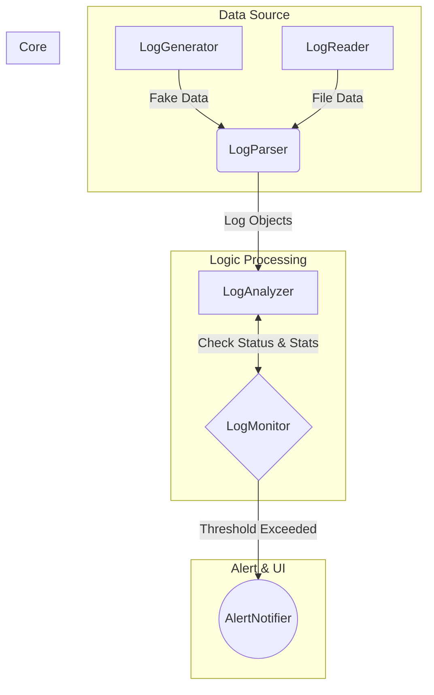

<h1 align="center">Distributed System Log Aggregator & Analyzer</h1>

<p align="center">
  
  
  
  
</p>

<p align="center">
  <strong>Hệ thống giả lập thu thập, phân tích và cảnh báo lỗi từ hàng nghìn dòng log của các dịch vụ phân tán.</strong>
</p>

---

## 📖 Giới thiệu tổng quan

Trong các hệ thống phân tán quy mô lớn, log được sinh ra liên tục với khối lượng khổng lồ. Việc các kỹ sư hệ thống (SRE/DevOps) phải đọc và tìm kiếm lỗi thủ công là bất khả thi. Các hệ thống hiện tại thường là "hộp đen", khiến việc dò tìm nguyên nhân sự cố (troubleshooting) mất hàng giờ đồng hồ.

**Distributed System Log Aggregator & Analyzer** ra đời nhằm giải quyết bài toán trên. Đây là đồ án môn **Data Structures & Algorithms (CSC10004)**, tập trung ứng dụng các cấu trúc dữ liệu nâng cao như **Trie, Hash Table, và Priority Queue** để:

- Tìm kiếm các pattern lỗi cực nhanh.
- Phân tích và thống kê tần suất lỗi theo thời gian thực.
- Xếp hạng mức độ nghiêm trọng và đưa ra cảnh báo kịp thời.

### 🎯 Kịch bản ứng dụng (Use Case)

> _2:00 sáng, hệ thống thanh toán bị gián đoạn._
> Thay vì tải toàn bộ log về máy để "mò kim đáy biển", kỹ sư SRE mở Terminal, hệ thống tự động lọc các dòng log có chứa từ khóa `ERROR` hoặc `TIMEOUT` từ hàng loạt microservices. Dữ liệu được sắp xếp theo thời gian và mức độ nghiêm trọng, giúp kỹ sư phát hiện ngay nguyên nhân là do "Kết nối Database bị nghẽn" (được đánh dấu **CRITICAL**).

## 🚀 Các tính năng chính

- **Lọc và tìm kiếm siêu tốc:** Sử dụng `Trie` để tra cứu các tiền tố (prefix) và từ khóa lỗi trong tích tắc.
- **Thống kê Real-time:** Ứng dụng `Hash Table` để đếm tần suất lỗi theo `Service_ID` với độ phức tạp $O(1)$.
- **Cảnh báo thông minh:** Quản lý luồng log sự cố bằng `Priority Queue`, đảm bảo các lỗi `FATAL` / `CRITICAL` luôn được đẩy lên ưu tiên xử lý trước các thông báo `INFO`.
- **Sắp xếp theo thời gian:** Tối ưu hóa việc hiển thị dòng thời gian sự kiện bằng thuật toán `QuickSort`.
- **Simulate Real-time Logging:** Tích hợp tính năng giả lập (inject) log lỗi trực tiếp để kiểm thử luồng cảnh báo.

## 🧠 Kiến thức DSA Áp Dụng

| Cấu trúc / Thuật toán     | Mục đích áp dụng trong dự án                           | Lý do lựa chọn                                                                  |
| :------------------------ | :----------------------------------------------------- | :------------------------------------------------------------------------------ |
| **Trie**                  | Tìm kiếm từ khóa lỗi (`ERROR`, `FATAL`, `TIMEOUT`,...) | Tối ưu hóa tốc độ tìm kiếm tiền tố (prefix search) trên tập string lớn.         |
| **Hash Table**            | Đếm tần suất lỗi theo từng dịch vụ                     | Cung cấp khả năng truy xuất và mapping `Service_ID` với độ phức tạp $O(1)$.     |
| **Priority Queue** (Heap) | Quản lý mức độ nghiêm trọng của log                    | Tự động phân loại và ưu tiên các lỗi nghiêm trọng (`FATAL` > `ERROR` > `WARN`). |
| **QuickSort**             | Sắp xếp lịch sử log                                    | Đảm bảo các sự kiện được duyệt và hiển thị đúng theo trình tự thời gian.        |

## ⚙️ Kiến trúc hệ thống



## 📂 Cấu trúc thư mục

```text
syslog-analyzer-core/
├── app/
│   ├── core/
│   │   ├── Log.hpp              # Struct dữ liệu log
│   │   └── LogParser.hpp        # Xử lý string -> object
│   ├── source/
│   │   ├── LogGenerator.hpp     # Tạo log ngẫu nhiên
│   │   └── LogReader.hpp        # Đọc từ file
│   ├── processing/
│   │   ├── LogAnalyzer.hpp      # Dùng cấu trúc từ lib/ để phân tích
│   │   └── LogMonitor.hpp       # Logic kiểm tra ngưỡng (threshold)
│   ├── output/
│   │   └── AlertNotifier.hpp    # In cảnh báo ra màn hình
│   └── main.cpp                 # Nhạc trưởng (Orchestrator) điều phối hệ thống
├── data/
│   └── raw_logs.txt             # Dữ liệu log đầu vào (giả lập)
├── lib/
│   ├── Trie.hpp                 # Template class Trie
│   ├── HashTable.hpp            # Template class Hash Table
│   └── PriorityQueue.hpp        # Template class Priority Queue
├── Makefile                     # Script build dự án
└── README.md
```

## 🛠 Hướng dẫn cài đặt và sử dụng

### 1. Yêu cầu hệ thống

- Trình biên dịch hỗ trợ **C++17** trở lên (GCC, Clang).
- Môi trường: Linux/macOS hoặc Windows (WSL/MinGW).
- `make` (Tùy chọn, để build nhanh).

### 2. Biên dịch (Build)

```bash
# Clone repository
git clone https://github.com/yourusername/syslog-analyzer-core.git
cd syslog-analyzer-core

# Build bằng Makefile
make

# Hoặc build thủ công bằng g++
g++ -std=c++17 app/main.cpp -I lib -o syslog_analyzer
```

### 3. Khởi chạy

```bash
./syslog_analyzer
```

### 4. Menu Chức năng (Demo)

Khi chạy chương trình, bạn sẽ thao tác qua giao diện CLI:

1. **Load log:** Đọc dữ liệu từ thư mục `data/`.
2. **Search:** Nhập từ khóa để tìm kiếm lỗi nhanh.
3. **Dashboard:** Hiển thị báo cáo thống kê top các dịch vụ bị lỗi.
4. **Simulate:** Kích hoạt giả lập inject log lỗi (Ví dụ: `Connection Refused`) để xem cảnh báo Real-time.

## 📅 Roadmap Phát triển (2 Tuần)

- [ ] **Tuần 1.1:** Thiết kế kiến trúc, cài đặt các CTDL cơ bản (List, Stack, Queue) bằng **Templates C++**.
- [ ] **Tuần 1.2:** Hoàn thiện module `LogParser` và `HashTable` để thống kê tần suất lỗi.
- [ ] **Tuần 2.1:** Tích hợp `Trie` (tìm kiếm) và `PriorityQueue` (quản lý cảnh báo).
- [ ] **Tuần 2.2:** Tối ưu hóa bộ nhớ (Memory leak tracking bằng RAII), viết `Makefile` và chuẩn bị kịch bản Demo.

## 👥 Phân chia công việc

- **Thành viên A (Vai trò Data Engineer):**
  - Tập trung vào các thư mục `core/` và `processing/` (phần nặng về giải thuật và cấu trúc dữ liệu).
  - Phụ trách xây dựng các cấu trúc dữ liệu cốt lõi (`lib/HashTable.hpp`, `lib/Trie.hpp`) và định nghĩa `LogParser` – mắt xích chuyển đổi dữ liệu cực kỳ quan trọng trong pipeline.
- **Thành viên B (Vai trò DevOps/SRE):**
  - Tập trung vào các thư mục `source/`, `output/` và cấu hình `LogMonitor`.
  - Quyết định "khi nào thì báo động" và "báo động như thế nào", mô phỏng chuẩn xác vai trò và luồng vận hành của một hệ thống thực tế.
- **Phối hợp chung:**
  - Liên kết các module tại `app/main.cpp`. File này giờ đây chỉ đóng vai trò là "nhạc trưởng" với một vòng lặp rõ ràng: `Reader` -> `Parser` -> `Analyzer` -> `Monitor` -> `Notifier`.

---

_Dự án được thực hiện nhằm đáp ứng yêu cầu môn học cấu trúc dữ liệu và giải thuật. Chúng tôi không sử dụng các thư viện `std::map`, `std::priority_queue` có sẵn của STL đối với các yêu cầu bắt buộc tự cài đặt CTDL._
